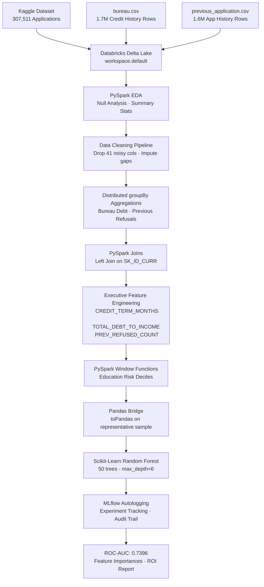

#  Home Credit Default Risk Engine

> *An end-to-end distributed data engineering and machine learning pipeline built on Databricks Serverless + PySpark, trained on 307,511 real loan applications to identify borrowers at risk of default.*

[](https://python.org)
[](https://spark.apache.org)
[](https://databricks.com)
[](https://mlflow.org)
[](https://scikit-learn.org)
[]()

---

## 📖 Data Story

**→ [View the Live Interactive Data Story](https://tolani007.github.io/Data-Engineering-vault/home-credit-risk-engine/)**
 *(open locally or via GitHub Pages)*

A scrollable, executive-grade visual narrative of the findings — built for non-technical stakeholders, VPs, and Directors who need answers, not code.

---

## Business Problem

Home Credit serves borrowers who are often invisible to traditional banks — people with little or no formal credit history. While this is a commercially significant mission, it introduces a structural risk: **without a credit trail, how do you reliably identify who can repay?**

Our analysis across **307,511 real loan applications** reveals that **8.07% of borrowers ultimately default**, exposing an estimated **$718 million in at-risk principal** at average loan sizes. This pipeline quantifies that risk and demonstrates how it can be systematically reduced.

---

## Architecture



---

## Key Results

| Metric | Value |
|--------|-------|
| Applications Analyzed | 307,511 |
| Observed Default Rate | 8.07% |
| Historical Records Mined | 3.3 Million |
| Features Engineered | 90 (incl. 4 custom) |
| **Final ROC-AUC Score** | **0.7396** |
| Estimated Preventable Defaults (Full Portfolio) | ~4,963/yr |
| **Projected Annual Savings** | **$143.9M USD** |

---

## Top 5 Default Predictors

| Rank | Feature | Source | Importance |
|------|---------|--------|-----------|
| 1 | External Credit Score (Bureau 3) | Credit Bureau | 25.4% |
| 2 | External Credit Score (Bureau 2) | Credit Bureau | 24.1% |
| 3 | Applicant Age | Application | 5.1% |
| 4 | **Previous Refusal Count** ✦ | *Engineered from 1.6M rows* | 4.3% |
| 5 | Education Level | Application | 2.8% |
| 7 | **Credit Term Months** ✦ | *Engineered: AMT_CREDIT/AMT_ANNUITY* | 2.7% |

> ✦ Features marked **Engineered** did not exist in the raw data. They were constructed by our distributed PySpark aggregation pipeline from 3.3 million historical records — and became two of the top seven most predictive signals in the model.

---

## Technical Highlights

### Distributed Data Engineering (PySpark)
- Ingested 3 relational Delta Tables (307K + 1.7M + 1.6M rows) on Databricks Serverless
- Implemented dynamic null-threshold dropping pipeline (removed 41/122 noisy columns)
- Performed distributed `groupBy` aggregations to compress 3.3M rows into 1-row-per-applicant summaries
- Used PySpark `Window` functions to calculate Education Risk Deciles — ranking borrowers against their demographic peers

### Executive Feature Engineering
```python
# Debt-to-Income: captures total leverage including bureau debt
df_features = df_master.withColumn(
    "TOTAL_DEBT_TO_INCOME",
    (col("AMT_CREDIT") + col("BUREAU_TOTAL_DEBT")) / (col("AMT_INCOME_TOTAL") + 0.0001)
)

# Loan Term: longer repayment horizon = higher default risk
df_features = df_features.withColumn(
    "CREDIT_TERM_MONTHS",
    col("AMT_CREDIT") / (col("AMT_ANNUITY") + 0.0001)
)

# Previous Refusals: engineered from 1.6M internal history rows
prev_agg = df_prev_app.groupBy("SK_ID_CURR").agg(
    F.sum(F.when(F.col("NAME_CONTRACT_STATUS") == "Refused", 1).otherwise(0))
     .alias("PREV_REFUSED_COUNT")
)
```

### Infrastructure Challenge Resolved
Databricks Serverless enforces a strict **1 GB Spark Connect ML cache limit**, which blocked standard PySpark MLlib training on the full dataset. The resolution was to bridge the distributed Spark computation into localized `Pandas` memory for the final ML step — a pattern commonly employed in production FinTech pipelines when serverless constraints apply:
```python
pdf = df_features.toPandas()        # Pull from cluster → driver node
rf = RandomForestClassifier(...)    # Train natively outside gRPC bridge
rf.fit(X, y)                        # No Spark Connect overhead
```

### Compliance & Governance
All model runs are automatically logged via **Databricks MLflow Autologging**:
- Hyperparameters versioned per run
- ROC-AUC, precision, recall tracked per experiment
- Model artifact stored with lineage traceable to original Delta Table ingestion

---

## File Structure

```
home-credit-risk-engine/
├── index.html                  # Interactive data story (open in browser)
└── README.md                   # This file
```

The full PySpark notebook lives in your Databricks Workspace: `Home Credit Default Risk: 01_Data_Ingestion`

---

## How to Reproduce

1. **Create a Databricks Free Trial** at [databricks.com](https://databricks.com)
2. **Download the dataset** from [Kaggle: Home Credit Default Risk](https://www.kaggle.com/c/home-credit-default-risk)
3. **Upload to Databricks Catalog**: `application_train.csv`, `bureau.csv`, `previous_application.csv`
4. **Open a new Notebook** (Serverless compute) and execute the cells in order as documented in the Notebook
5. The full pipeline runs end-to-end in under 15 minutes on Databricks Serverless 2XS

---

## Business Recommendations

Based on the model's feature importances and financial projections, three operational decisions are recommended:

1. **Mandate External Credit Scores** — EXT_SOURCE_2 and EXT_SOURCE_3 together account for ~50% of predictive power. Missing scores = escalate to senior review.
2. **Flag Repeat-Refusal Applicants** — The `PREV_REFUSED_COUNT` feature should trigger mandatory additional underwriting review.
3. **Introduce Risk-Tiered Loan Terms** — High-risk applicants identified by the engine should be offered shorter, smaller initial loans before accessing larger credit lines.

---

## Stack

| Layer | Technology |
|-------|-----------|
| Cloud Platform | Databricks Serverless |
| Distributed Processing | Apache PySpark 3.5 |
| Storage | Databricks Delta Lake |
| ML Training | Scikit-Learn Random Forest |
| Experiment Tracking | MLflow Autologging |
| Data Visualization | Chart.js · Seaborn · Matplotlib |
| Language | Python 3.12 |

---

*Part of the [Data Engineering Vault](https://github.com/tolani007/Data-Engineering-vault) — a professional portfolio of production-grade Big Data projects.*
