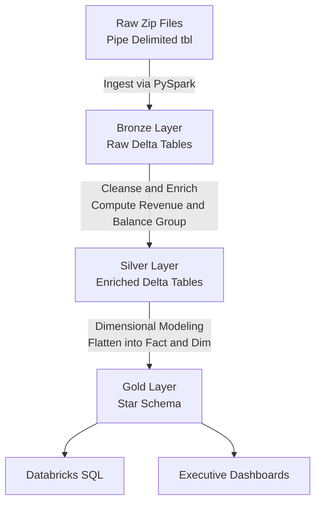

# Prospa Data Engineering and ETL Pipeline

> An end-to-end modern data stack pipeline built natively on Databricks Serverless, ingesting raw transactional data into a Star Schema optimized for high-performance BI reporting.

## Interactive Data Story
**[View the Live Interactive Data Story](https://tolani007.github.io/Data-Engineering-vault/prospa-etl-challenge/)**
 *(Executive presentation of the Star Schema analytics and Data Modeling).*

## The Challenge

Prospa required a robust ETL capability to digest raw flat file transactions like customer.tbl, orders.tbl, and lineitem.tbl, and model them into a highly performant Star Schema. This empowers the business to easily slice and dice metrics like Year over Year growth and top revenue nations without writing punishing 3NF table joins.

## Step by Step Instructions to Replicate

1. Open Databricks Catalog and create a new Volume called prospa_volume in your default schema.
2. Upload prospa_data.zip into that new volume.
3. Import the 01_Data_Ingestion.dbc workspace archive into your Databricks workspace.
4. Open the 01_Data_Ingestion notebook and attach it to a running compute cluster.
5. Run the cells sequentially. The notebook will automatically:
    - Extract the raw data zip into pipe delimited text files.
    - Ingest them utilizing PySpark StructTypes into raw Bronze Delta Tables.
    - Cleanse and transform the tables, calculating line item revenue and placing customers in balance groups, saving them as Silver Delta Tables.
    - Flatten the normalized relational dimensions into a centralized Gold Star Schema.
    - Execute Databricks SQL queries to answer the analytical business questions.

## Medallion Architecture Strategy

## Implementation Highlights

1. **Bronze Layer Ingestion**: Ingested 8 pipe delimited text files dynamically via PySpark StructTypes, purposely stripping out the trailing null delimiters inherent to standard database benchmarking formats, and persisting them as foundational Delta Tables.
2. **Silver Layer Enrichment**: 
    *   Dynamically categorized c_acctbal into logical Low Balance, Medium Balance, and High Balance groupings natively in PySpark.
    *   Generated Lineitem level revenue metrics natively using l_extendedprice * (1 - l_discount).
3. **Gold Layer Star Schema**: Smashed the normalized snowflake components Nation, Region, and Customer into wide, flat Dimensions like dim_customer surrounding a hyper optimized central fact_sales table.

## Architecture Q&A

**1. How can we schedule this process to run multiple times per day?**
> In a modern Databricks environment, this pipeline is orchestrated via **Databricks Workflows (Jobs)**. We define the notebook or individual python scripts as tasks inside a DAG, and assign a CRON trigger scheduling it to run at intervals like every 4 hours. 

**2. How do you cater for data arriving in random order or from streams?**
> We pivot from standard batch processing to **Databricks Auto Loader (cloudFiles)** and **Spark Structured Streaming**.
> Auto Loader acts as a highly efficient directory listener; the moment new data lands in the S3 bucket or Volume, it streams the change.
> By writing to Delta Lake via .trigger(availableNow=True) and utilizing Delta's MERGE INTO operation for UPSERTS, we flawlessly handle late arriving or out of order data, updating previous records if keys match without duplicating them.

**3. How do you deploy this code to Production and Containerization?**
> Code promotion is handled via CI CD using **Databricks Asset Bundles (DAB)** or Terraform backed by GitHub Actions, decoupling development from production workspaces. 
> To containerize the environment for Docker, we leverage **Databricks Container Services (DCS)**. This allows us to construct a Dockerfile packaging bespoke Python libraries and environment variables, mapping the compute cluster heavily to the container image rather than standard Databricks runtimes limits.

Part of the Data Engineering Vault, a professional portfolio of production grade Big Data projects.
